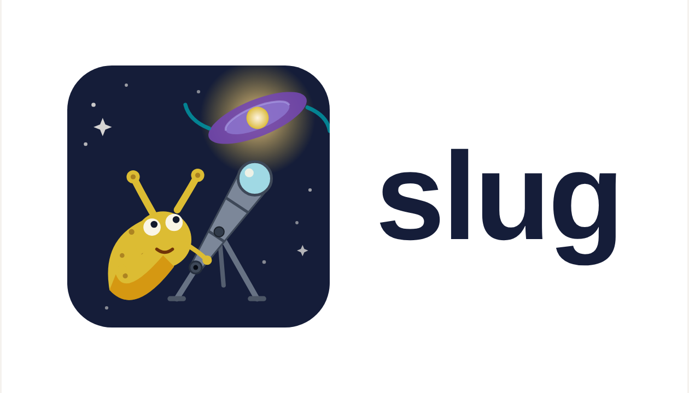

.. slug documentation master file.
   You can adapt this file completely to your liking, but it should at least
   contain the root `toctree` directive.

Welcome to slug's documentation!
================================

Contents:

.. toctree::
   :maxdepth: 2

   quickstart
   license
   intro
   getting
   compiling
   running
   parameters
   pdfs
   output
   tracks
   atmospheres
   photometry
   nebular
   extinction
   slugpy
   cloudy
   examples
   troubleshooting
   tests
   python_api
   cpp_api/cpp_api_root
   acknowledgements

Indices and tables
==================

* :ref:`genindex`
* :ref:`modindex`
* :ref:`search`
